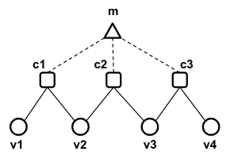
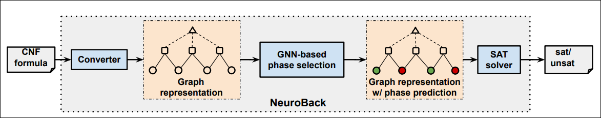
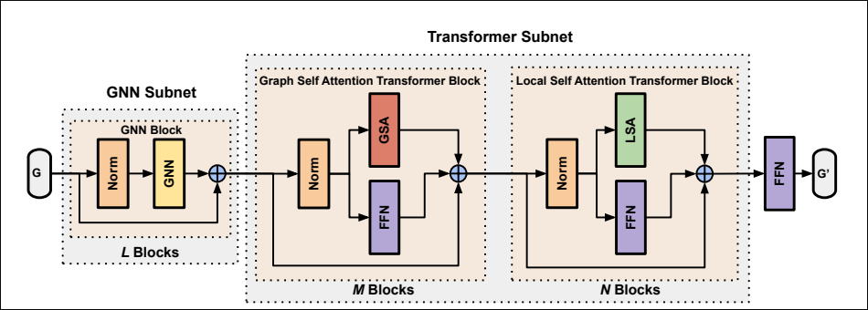
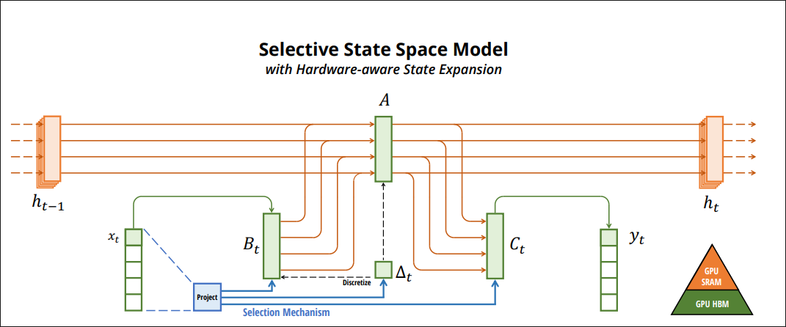
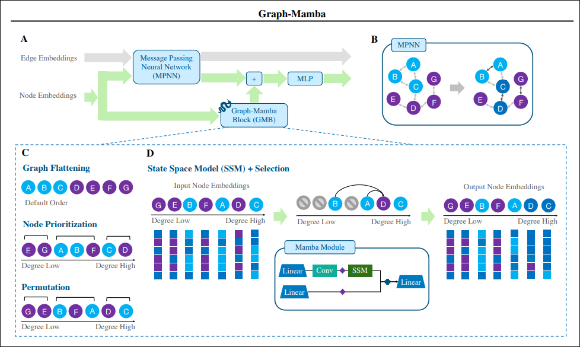
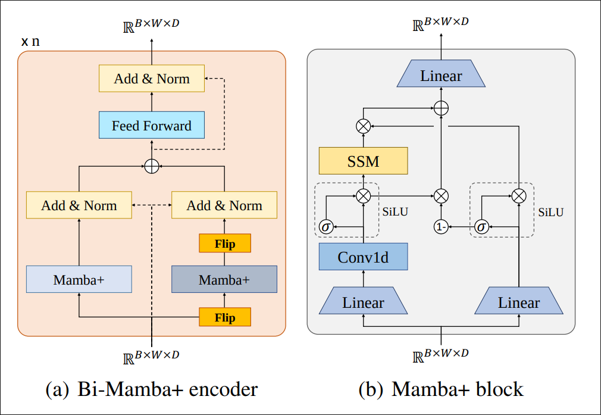
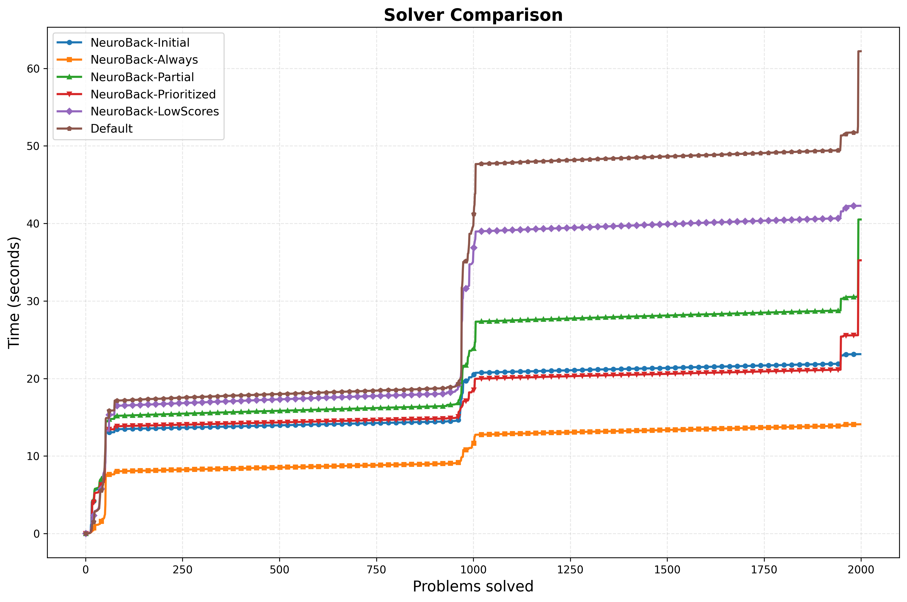

<!-- _class: title --->

# Modificaciones de NeuroBack

Sebastián Gutiérrez, Jose Pinto, Nicolás Barahona, Matías Sandoval, Fernando Salgado y Sophia Escobar  
Nombre, Nombre

---

# Tabla de contenidos

    

        

        

            <h3 class="beam-section-title">Contexto</h3>
        

    

    
  

      

      

          <h3 class="beam-section-title">Modelo Neuroback</h3>
      

  

    
  

      

      

          <h3 class="beam-section-title">Heurísticas</h3>
      

  

  

  

      

      

          <h3 class="beam-section-title">Resultados</h3>
      

  

  
  

      

      

          <h3 class="beam-section-title">Discusión y conclusiones</h3>
      

  

---

# NeuroBack

- Objetivo: mejorar solvers CDCL para SAT usando Graph Neural Networks de forma práctica y eficiente.
- Busca predecir las "fases" mayoritarias de variables (backbone) con una GNN una sola vez antes de resolver y aplicar esas predicciones durante la búsqueda, evitando inferencias frecuentes en GPU mientras ejecuta el solver.

---

# NeuroBack: Estado del arte

Los métodos previos similares a Neuroback como Janota(2010), NeuroSat o NeuroCore:
- No mejoraban los resultados.
- Requerían frecuentes inferencias online en GPU.
Lo que inducia en un peor desempeño.
---

# NeuroBack: Método

- Representación: grafo CNF (nodos de variables y cláusulas, aristas según incidencia). 

- GNN que predice la fase mayoritaria (Backbone) para cada variable.
- Las predicciones se fijan/inyectan como sugerencias iniciales para el solver; el solver sigue siendo CDCL pero con mejor punto de partida.

---

# NeuroBack 

- DataBack: nuevo dataset con 120,286 muestras para entrenar el modelo.
- Integración con el solver Kissat, mostrando mejoras en problemas resueltos (+5.2% en SATCOMP-2022, +7.4% en SATCOMP-2023).
- Demuestra que una inferencia offline bien entrenada puede ser suficiente para proporcionar señales útiles a heurísticas clásicas.

---
# Modelo Neuroback

Es una arquitectura hibrida de Graph Transformer disenada para superar las limitaciones de memoria (self-attention $O(N^2)$) para formulas SAT muy grandes.

Su objetivo es predicir la fase de las variables, especialmente las del backbone para luego ser utilizadas en un SAT Solver.

---
# Modelo Neuroback

---
# Modelo Neuroback

---
# GSA

La GSA es un mecanismo de atención que restringe el cálculo de "quién atiende a quién". 

A diferencia de la auto-atención global de un Transformer estándar (que calcula la relación de todos los nodos contra todos los nodos), la GSA solo calcula puntuaciones de atención para pares de nodos directamente conectados en el grafo.

GSA reduce esto a una complejidad lineal respecto al número de aristas $O(|E|)$.

---
# LSA

LSA no realiza atención entre diferentes nodos. En su lugar, toma el vector de características (embedding) de un solo nodo, lo segmenta en "parches" (sub-vectores) y calcula la auto-atención entre estos parches.

Si el embedding de un nodo tiene dimensión $D$, LSA lo remodela a una secuencia de longitud $D/P$ con dimensión $P$. La atención se calcula internamente sobre esta secuencia.

Al operar dentro de cada nodo independientemente, la complejidad de memoria desciende a $O(|V|)$ 

---
# Limitaciones

Al eliminar la atención global, el modelo depende de la propagación capa por capa para ver "lejos". (Aunque introducen "meta-nodos" para reducir el diámetro del grafo)

---
# Mamba

Mamba es una arquitectura de modelo de secuencia basada en Structured State Space Models (SSMs).

A diferencia de los Transformers, que utilizan el mecanismo de atención con complejidad cuadrática $O(N^2)$ respecto a la longitud de la secuencia, Mamba logra una escala lineal $O(N)$ en longitud de secuencia . 

Esto lo convierte en una alternativa eficiente para modelar secuencias extremadamente largas

---
# Mamba

---
# Graph Mamba

Graph-Mamba es una arquitectura de red neuronal para grafos que integra el bloque Mamba (Selective State Space Model) dentro del framework estándar GraphGPS, reemplazando el costoso módulo de Atención de los Graph Transformers .

Es el primer intento exitoso de adaptar los modelos de espacio de estados (SSMs), diseñados originalmente para secuencias (texto, audio), al dominio de los grafos, que son inherentemente no secuenciales .

---
# Graph Mamba

En lugar de submuestrear el grafo aleatoriamente, utiliza el mecanismo de selección de Mamba para realizar un filtrado de nodos dependiente de la entrada . Esto permite que el modelo decida dinámicamente qué nodos son relevantes para el contexto y cuáles ignorar, manteniendo una complejidad lineal $O(L)$ .

---
# Graph Mamba

¿Cómo conviertes un Grafo en Secuencia?

**Aplanamiento y Priorización de Nodos**: Dado que el escaneo de Mamba es unidireccional por lo tanto, el orden importa muchísimo. Graph-Mamba ordena la secuencia de entrada basándose en heurísticas como el grado del nodo. La idea es que los nodos "mas importantes" sean capaz de ver el contexto de todos los nodos anteriores

---
# Graph Mamba

---
# Bi-Mamba+

Bi-Mamba+ es una arquitectura diseñada para la Predicción de Series Temporales a Largo Plazo (LTSF). 

Es una evolución directa de Mamba que introduce dos mejoras críticas: bidireccionalidad para entender el contexto completo (pasado y futuro relativo) y un mecanismo de "olvido" mejorado para manejar historiales muy largos.

---
# Bi-Mamba+

- **Mamba+**: El bloque Mamba original tiende a priorizar la información reciente. Bi-Mamba+ introduce una puerta de olvido (forget gate) explícita dentro del bloque.

- **Bidireccionalidad (El Contexto Total)**: Las series temporales, al igual que los grafos aplanados, tienen patrones complejos que se entienden mejor si se miran en ambas direcciones. Bi-Mamba+ procesa la secuencia de adelante hacia atrás y de atrás hacia adelante, fusionando ambos resultados.

---
# Bi-Mamba+

---
# NeuroBackMamba

`NeuroBackMamba` es el resultado de aplicar la lógica de Graph-Mamba para preprocesar los datos, el motor de Mamba para el cómputo, y la arquitectura de Bi-Mamba para la robustez del contexto.

---
# NeuroBackMamba

- **Graph-Mamba**: Ordena los nodos basándose en su grado (cuántas veces aparece una variable en las cláusulas). Además, añade ruido aleatorio durante el entrenamiento (`score = node_degrees + noise`) para simular la permutación y evitar el sobreajuste a un orden específico.

- **Mamba**: El uso de SSMs y porder "comprimir" la información de todas las variables anteriores en un estado oculto finito.

- **Bi-Mamba+**: Procesa la secuencia en ambas direcciones, Esto asegura que cada variable tenga contexto tanto de sus "predecesores" como de sus "sucesores" en la lista ordenada.

---
# NeuroBackMamba - Ventajas

- **Escalabilidad**: Gracias a las SSMs, y su mejor uso de memoria, podemos usar formulas mas grandes y tener redes mas profundas.

- **Contexto global**: Neuroback, sacrifica tener un contexto global para poder bajar su complejidad.

---
# NeuroBackMamba - Desentajas

- **Perdida de topologia**: Al aplanar el grafo, perdemos la estructura explicita de quien es vecino de quien.

- **Dependencia de la heuristica de ordenamiento**: Si nuestra heuristica para ordenar los nodos al aplanar el grafo es mala, podriamos tener problemas para encontrar las relaciones.

---

# Heurísticas

- Neuroback-Kissat funciona con Sistema cascada.
- Implementacion sencilla pero efectiva.
- Preexistentes
    - Neural-backbone  --initial (principal).
    - Neural-backbone  --always.
- Propuestas
    - Partial-backbone
    - Prioritized-backbone
    - LowScores-backbones

---

# Heurísticas: Initial/Always backbone

- Initial backbone
    - Utilización de la red solo para el signo inicial
- Añways backbone.
    - Priorización del uso de la red para todas las decisiones
- Admiten como posible variable de backbone si la confianza es alta
- Por cada una, se elige variable, se asigna fase, y se propaga

---

# Heurísticas: Partial backbone

- Heurística estocástica.
- Utilizar una fracción del backbone predicho.
- Puede ayudar en problemas donde el backbone predicho no es completamente correcto.

---

# Heurísticas: Prioritized backbone 

- Heurística de variable branching
- La cola de decisión se ordena según probabilidad de predicción
- Posterior a esto, se aplica phase selection

---

# Heurísticas: LowScores backbone 

- Kissat utiliza VSIDS como heurística. 
- Utilizar el backbone solo a variables poco activas.
    - Variables de alta actividad: VSIDS ha demostrado ser confiable → se sigue usando VSIDS.
    - Variables de baja actividad: VSIDS es menos informativo → aquí las predicciones de la GNN pueden aportar valor.

---
# Resultados

---
# Resultados: Estadísticas Promedio

| Método | Conf. | Dec. | Prop. | Rest. |
|--------|-------|-------|-------|-------|
| Kissat-Default | 4180.27 | 4794.67 | 103735.14 | 1.39  |
| NeuroBack-Initial | 3008.45 | 3440.61 | 71466.02 | 1.09 |
| NeuroBack-Always | 4288.21 | 4896.27 | 94072.07 | 1.41 |
| NeuroBack-Partial | 3918.71 | 4524.27 | 107093.13  | 1.31 |
| NeuroBack-Prioritized | 3959.69 | 4537.95 | 96460.14 | 1.32 |
| NeuroBack-LowScores | 4486.98 | 5026.29 | 107783.91 | 1.44 |

---
# Resultados
- En promedio NeuroBack-Initial tuvo mejor rendimiento.
    - Menor tiempo de ejecución, y menos restarts.
- Las heurísticas implemtentadas tienen en general peor rendimiento que NeuroBack-Initial pero mejor que kissat-default.
- Partial y prioritized destacan del resto.
---
# Discusión y conclusiones
---

# Referencias
- Wenxi Wang et al., "NeuroBack: Improving CDCL SAT Solving using Graph Neural Networks", arXiv:2110.14053 
